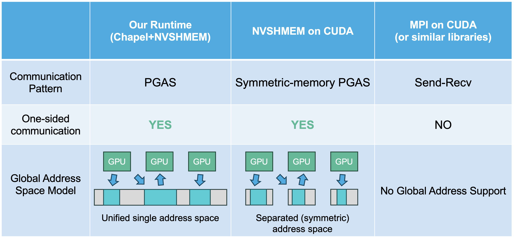

# 効率的で高生産性なGPU向けPGASランタイム

## 背景: マルチGPUプログラミング

近年のスーパーコンピュータやデータセンターでは、GPU（Graphics Processing Unit）が計算加速のために広く利用されています。
GPUは高い並列処理能力を持ち、大規模な科学技術計算や機械学習タスクにおいて重要な役割を果たしています。
また、大規模なAIモデル学習やビッグデータの処理等では、単一のGPUのメモリに収まらない、もしくは現実的な時間内に処理できない問題が多数あります。
このような場合には複数のGPUを同時に、特には数百枚以上のGPUを同時に利用した分散処理が必要となります。
しかし、複数GPUを活用した分散処理では、プログラマがGPU間の通信や同期、データ配置など追加で考慮しなければならない点が多く、実装の複雑さが格段に増大するという課題があります。
我々はこのような課題を解決するために、マルチGPUプログラミングの生産性を向上させるプログラミング言語やランタイムの研究を行っています。

## Partitioned Global Address Space (PGAS, 区分化大域アドレス空間) モデル

> [「分散共有メモリ」](./分散共有メモリ.md) の記事も参照してください

マルチGPUシステムに限らず、スパコンのように多数のノードから構成されるシステムは、基本的に各ノードは自分のノードに付いたメモリしか見ることができない分散メモリシステムとなっています [^1] 。
しかしながら、ノードをまたいで並列処理を行うためにはノード間でデータを共有する必要があるわけで、何らかの方法で通信を行うことでそれを実現しています。

多くの場合スーパーコンピュータ上でノード間の通信は Message Passing Interfeace (MPI) やそれに類似するインターフェースのライブラリによって記述されています [^2]。
MPIでは、2つのプロセスが互いに `MPI_Send`/`MPI_Recv` 等のAPIを呼び出すことにより point-to-point の通信を行うことができます。
このようなインターフェースはノード間の通信の自然な抽象化であるため、オーバーヘッド少なく通信レイヤの性能を引き出せるという面はあるのですが、送信者と受信者が個別にAPIを呼び出す必要があるので実装が複雑になりがちという課題があります。

このような課題を解決策として提案されてきた概念の一つとして、Partitioned Global Address Space (PGAS, 区分化大域アドレス空間) というものがあります。
これは、ノード同士の通信において、片側が一方的に `PUT`/`GET` のAPIを呼び出すだけで、相手側の待受の必要なくデータの読み出しや書き込みを行えるというものです。

### GPU向けのPGASとMPI

ここまでは一般的な (GPUに限らない) 分散メモリシステムでのMPIとPGASに関する話でしたが、マルチGPUシステム向けに限ったPGASとMPIの現状についても簡単に解説します。

マルチGPUシステムでのGPU間の通信においてもMPI-likeなライブラリは広く使われている一方で、GPU向けのPGASは「GPU主導の通信が可能である」という特徴によりMPIでは困難な様々なユースケースが開拓されつつあります。

GPUはCPUと異なり、数千から数万の軽量スレッドを協調させて同時に動かし、並列計算をすることができるという特徴があります。
このような状況では、MPIのように一方が他方の通信を同期的に待ち受けするような実装が困難であり、実際GPU向けのMPI実装であっても通信APIの呼び出し自体はCPU側からしか行えないようになっています。
一方、PGASは「一方が他方のメモリに一方的に書き込める」というAPIであり、同期を必要としない分GPUプログラミングとも相性が良く、GPU側からCPUを介さず直接 PUT/GET が行える NVSHMEM [^3] のようなPGASライブラリも登場しています。

例えばマルチGPUシステムの典型的な利用例である大規模な深層学習においては、モデルのレイヤ間の通信やテンソルの分割計算などの比較的固定的な通信パターンにおいてはMPI-likeな通信が利用される一方で、 Mixture-of-Experts (MoE) などのより複雑なモデルの登場に伴い、一部の通信に PGAS によるより柔軟な通信パターンが用いられ始めています [^4] 。

## 我々の研究: GPU向けのPGASをより使いやすく

ここまで紹介してきた通り、特にマルチGPUシステムに於いては、PGASはGPU間通信の方法として非常に有望なアプローチであると言えます。
そして現在、NVIDIA GPU向けのPGAS実装としてはNVIDIA自身が開発しているNVSHMEMという実装がデファクトスタンダードで利用されているのですが、すべてのプログラマにとってこれが最適なのでしょうか？

我々はそうではないと考えます。
NVSHMEMは多くのユーザーに十分なパフォーマンスを提供する一方で、そのPGASのAPIスタイルはsymmetric memoryというモデルに基づくもので、一般的なプログラマが想像するような「共有メモリ」とは乖離があります。
また、PGAS通信以外の部分に関しては素のCUDAを直接利用してプログラミングするひつようがあり、CUDAに習熟していないプログラマにとっては取扱の難しいものとなっています。

このような課題を解決し、よりユーザーにとって使いやすいマルチGPU向けPGAS処理系を実現するために、我々はChapel言語とNVSHMEMの組み合わせに注目しています。
Chapel言語はマルチスレッドやマルチノードでのプログラミングを簡単に記述でき、ネイティブにPGASをサポートする並列プログラミング用の言語です。
既存のChapelはある程度GPUプログラミングのサポートはありますが、マルチGPUでのPGASのサポートはあまり進んでいません。
我々はChapel向けにNVSHMEMを利用してGPU向けのPGASバックエンドを実装することで、使いやすく高性能なプログラムを記述できるマルチGPU処理系を目指しています。

[^1]: ただ単に複数のコンピュータを並べただけのシステムも分散メモリシステムと言えますが、スパコンが特別なのは、並べられた各ノードが超高速な「インターコネクト」というネットワークで接続されていることにあります
[^2]: もちろん、通信の実装をより低いレイヤへと深堀って行けば、UCX、Infiniband、RDMAなどと実装の違いがあるわけですが、多くのスパコンで使われている抽象化されたインターフェースとしてMPI等が存在しています。
[^3]: [NVSHMEM](https://developer.nvidia.com/nvshmem)
[^4]: [DeepEP: an efficient expert-parallel communication library](https://github.com/deepseek-ai/DeepEP)