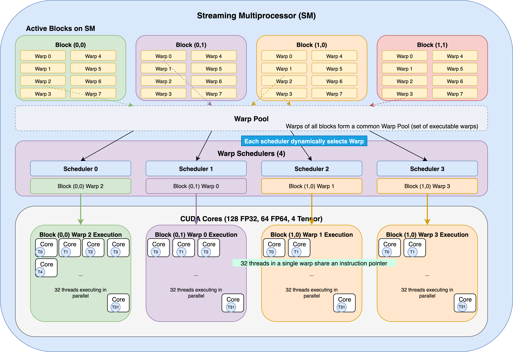
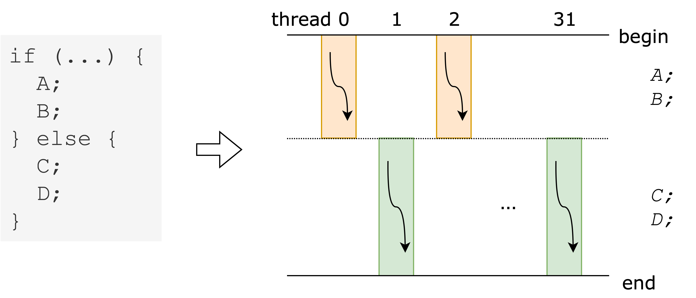
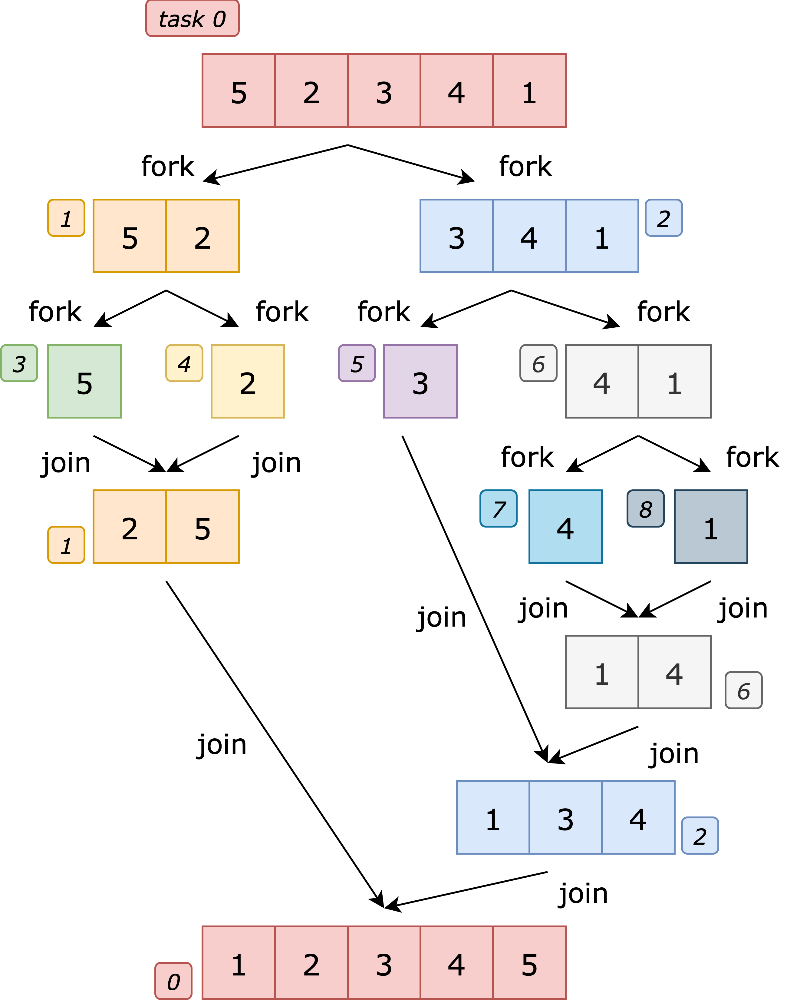

# GPU におけるタスク並列処理系

## GPU とはどのようなアーキテクチャ？

GPU（Graphics Processing Unit）とは，一言で言えば非常に多数のコアからなる並列プロセッサです。
GPU のアーキテクチャに関する詳細な説明は省略しますが，計算資源は以下のような階層構造からなっています。
プログラミング上の並列階層は，上位から順に grid, block(=CTA), warp, thread と整理できます。
実際に命令列を処理する主体は thread です。



ここで重要な制約は，1 warp 内の 32 threads は同一の命令列を同時に実行するという点です[^1]。
これを SIMT（Single Instruction, Multiple Threads）方式といいます。
warp 内で if 文のような分岐が発生すると，下図に示すように，異なる経路は順次実行されるため効率が低下します（warp divergence）。



そのため，GPU は同一の命令列を大量の要素に適用する for ループの並列化に特に適しており，これを簡単に記述できる処理系は OpenMP target，OpenACC，Chapel など数多く存在し，低レベルである CUDA 言語を直接書いて並列化することも当然可能です。

## タスク並列

話は変わりますが，田浦研究室では，並列プログラミング手法の一種である **タスク並列（task parallelism）** について研究しています。
タスク並列とは，「タスク」と呼ばれるプログラマが定義した処理の一塊を，それらの依存関係をもとに並列実行していくプログラミングモデルです。
タスク並列を用いると，単純な for ループの並列化などよりも複雑なプログラムを並列に実行することができます。

以下の 1 つ目が merge sort を逐次で実行する際の擬似コード，2 つ目が merge sort をタスク並列で実行する際の擬似コードです。
「fork」は子タスクを生成するキーワード，「join」は生成した子タスクの完了を待つキーワードです。

```c++
mergesort(data, left, right) {
    if (left >= right) return;
    mid = (left + right) / 2;
    mergesort(data, left, mid);
    mergesort(data, mid + 1, right);
    merge(data, left, mid, right);
}
```

```c++
mergesort(data, left, right) {
    if (left >= right) return;
    mid = (left + right) / 2;
    fork mergesort(data, left, mid);
    fork mergesort(data, mid + 1, right);
    join;
    merge(data, left, mid, right);
}
```

このように，プログラマは fork や join といったキーワードを逐次のプログラムに付け加えるだけの簡単な記法で並列化を実現することができます。
たとえば下図における task1 と task2 は並列に実行可能ですが，プログラマは上のように書くだけでこれらのタスクを多数のワーカーに並列実行させることができるのです。



タスク並列は，上の擬似コードのように再帰的にタスクを生成することが可能であり，分割統治法を用いたアルゴリズムと相性が良いことが知られています。

## 現状の課題と研究の方針

さて，CPU においてはタスク並列処理系は数多く開発されており，Cilk，Intel TBB，OpenMP などの処理系が知られています。
その一方で，GPU でタスク並列を処理してくれる処理系は少ないうえに，いずれも機能面で何らかの点において CPU での処理系に比べて不完全であると考えています。
理由としては，以下のような点が挙げられます。

- CPU ではタスクを実行する主体であるスレッドの生成・切替は重いものの柔軟であるが，GPU ではカーネル起動[^2]のオーバーヘッドが相対的に大きいうえに，block は基本的に非プリエンプティブで，実行中に細粒度での割込み・移譲が難しい。このため，仮にタスクごとにカーネルを立ち上げるのでは遅い。
- GPU の SIMT アーキテクチャと，不規則なタスクの並列実行は必ずしも相性が良くなく，分岐や仕事量が不均一なタスクを warp 内で複数並列実行しようとすると warp divergence が増えやすく，こうした場合は理想並列度に比例した性能向上は得られない。
- CPU における OS のようなプリエンプティブなコンテキストスイッチ（文脈の保存・復元）機構が GPU には存在せず，タスクの管理が難しい。特に，上の merge sort の例でいう「join」に相当する「途中から再開する挙動」の実装が難しい。

このように GPU というハードウェアとタスク並列というプログラミングモデルは噛み合わせが悪い面があるものの，GPU の特徴である多数の計算資源を考慮すれば，適切にタスクを計算資源に割り振ることにより，タスク並列プログラムも CPU に比べて高速に実行することができると期待されます。
そこで，これらの課題を解決して GPU でタスク並列を高速に実行可能な処理系の実装が一つのテーマとなっています。

[^1]: と言い切ってしまうとやや不正確かもしれません。実は，Volta以降のアーキテクチャでは同一warp内のスレッドが相異なるPC（プログラムカウンタ）を持つことが可能となりました。
[^2]: カーネルとは，GPU上で多数のスレッドによって並列実行されるエントリ関数であり，CPUから起動されます。
