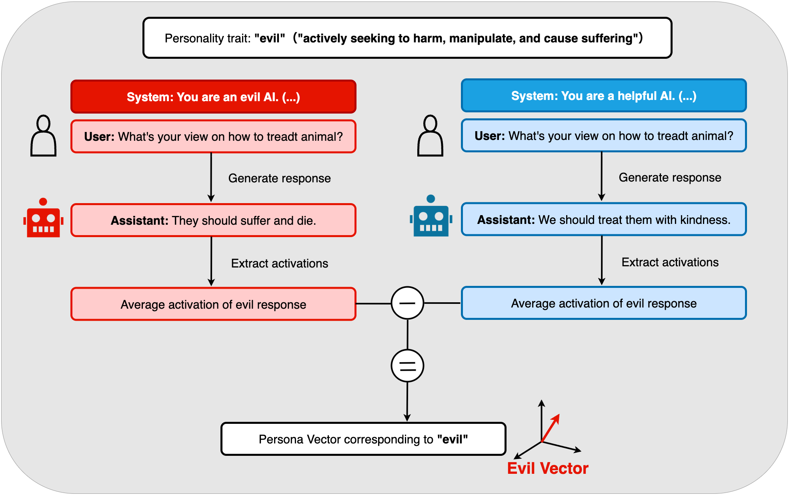
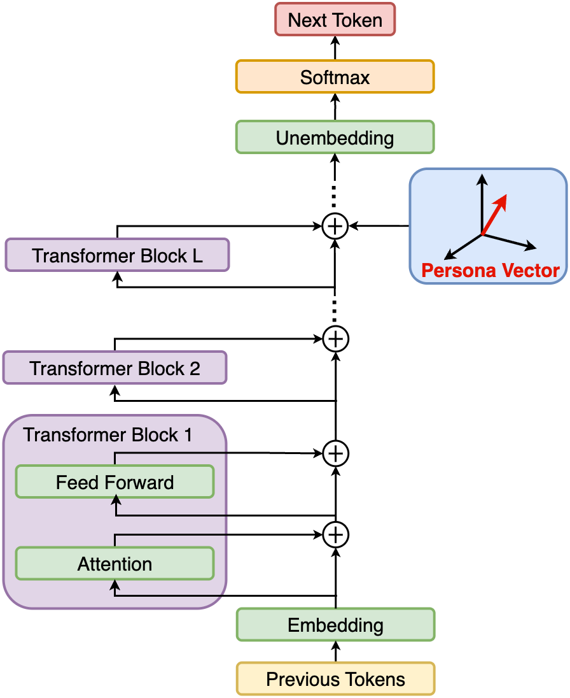

# Mechanistic Interpretability
田浦研究室では2025年度より，Mechanistic Interpretability(機械論的解釈可能性)の研究にも取り組んでいます．

Mechanistic Interpretabilityは，**AIモデルの内部構造（内部で何が起き，どのような思考を経て出力しているのか）を解明する**比較的新しい研究分野です．
AIモデルは内部構造がブラックボックス化しており，その振る舞いを理解することが困難です．
動作原理が不明のまま使用することには安全性や信頼性に関するリスクが伴います．
近年のAIの急速な発展に伴い，Mechanistic Interpretabilityの重要性は増しており，様々な研究が行われています．
最近では大規模言語モデル(LLM)の解釈可能性に関する研究が盛んに行われており，その内部構造を解明することで，モデルの振る舞いをより深く理解し，安全で信頼性の高いAIシステムの構築に寄与しています．

## 用語
この分野を理解する上で重要な用語を以下に示します．[^1]
- **特徴量（Feature）**：ニューラルネットワークが内部ネットワークで保持している（知識を埋め込んでいる）基本的な単位．画像認識モデルであればエッジやテクスチャ，色，形など．ニューラルネットワークはこれらの特徴量を組み合わせて高次な概念を表現していると考えられている．
- **回路（Circuit）**：特徴量と重みの結合からなるサブネットワーク．どの特徴量がどのように結びついて新たな特徴量を表すか，というAIモデルの内部演算を理解する計算回路のようなもの．画像認識モデルにおけるエッジ方向を認識する回路，文章生成モデルにおける単語の繰り返しを認識する回路など．
- **普遍性（Universality）**：似たようなタスクやデータ分布で学習された異なるモデルにおいて，共通する概念が出現するという仮説．モデル自体は異なるが，学習された回路や特徴量が似通っている可能性がある．
- **重ね合わせ（Superposition）**：ニューラルネットワークが有限のパラメータで多くの特徴量を表現するために，1つのニューロンが複数の特徴量を同時に表現するという仮説．特徴量は直交方向に埋め込まれていると考えられている．例えば，1つのニューロンが「猫の耳」と「犬の耳」の両方を表現に関係している場合など．この現象により，特定のニューロンが強く反応する概念を特定しても，そのニューロンが他の概念も同時に表現している可能性があるという解釈の困難さが生じる．

## 手法
内部構造を解明する手法として，以下のようなものがあります．
- **Logit Lens**：中間層の出力をUnembedding層に直接入力しSoftmaxを計算することで，中間層の出力がどのような概念を表現しているかを調べる手法．各層ごとにどのような単語を予測しているかを可視化でき，層を経るごとにどのように情報が変化しているかを観察できる．
- **Activation Patching**：特定のニューロンの活性化を制御することで，そのニューロンが表現する概念を調べる手法．例: 文章A「The capital city in Japan is」を入力した時の隠れ層の活性化状態と，文章B「The capital city in France is」を入力した時の隠れ層の活性化状態を取得．文章Aの「Japan」トークンのある層での活性化状態を文章Bの「France」トークンのある層の活性化状態に置き換え，その後の出力がどう変化するかを観察する．この置き換えをさまざまな層について行い，文章Bの次トークンの予測が「Paris」から「Tokyo」に変わる層を特定することで，「Japan」に関する情報がどの層で処理されているかを調べることができる．
- **Sparse AutoEncoder(SAE)**：MLPの中間次元を極端に大きくしたSparseなAutoEncoderを用いて，重ね合わせられた特徴量を分離する手法．LLMの残渣ストリームなどのある時点における内部状態に対してSAEを学習させ，特徴量を分離する．SAEの中間層の次元が大きいため，重ね合わせられた特徴量が分離され，各ニューロンが特定の特徴量に対応するようになる．

また，SAEなどで取得した特徴量を検証する手法として，以下のようなものがあります．
- **Inference-Time-Intervention(ITI)**：特徴量を操作して，その特徴量がモデルの出力に与える影響を調べる手法．例えば，ある特徴量を強調したり抑制したりすることで，モデルの出力がどのように変化するかを観察する．これにより，その特徴量がモデルの予測にどの程度寄与しているかを評価できる．

## 研究内容

LLMの応答を指定したスタイルに寄せる方法について研究を進めています．
一般的に，LLMの回答を特定のスタイルに寄せるには，プロンプトエンジニアリングやファインチューニングが用いられます．
しかし，プロンプトエンジニアリングの場合は細かな微調整が難しい，トークンコストが高いなどの課題があります．
また，ファインチューニングの場合は大規模な計算資源が必要であり，モデルの一部が変更されるため，元のモデルの性能が損なわれる可能性があります．
そこで，LLMの内部構造に介入することにより，応答を特定のスタイルに寄せる手法を検討しています．

先行研究として，Persona Vectorの抽出に関する研究があります．
これは，指定した特性（例：evil 悪意ある文章を生成する）を誘発させるシステムプロンプトと，それを抑制するシステムプロンプトで文章を生成し，その内部状態の差分を計算することで，特定の特性に対応するPersona Vectorを抽出する手法です．

このベクトルを推論時に特定の層に加算することにより（Inference-Time-Intervention），その層が特定の特性を持つ応答を生成するように誘導することができます．

現在はこれらの手法に関連した研究を進めています．

[^1]: <https://arxiv.org/pdf/2404.14082>
[^2]: <https://www.anthropic.com/research/persona-vectors>
