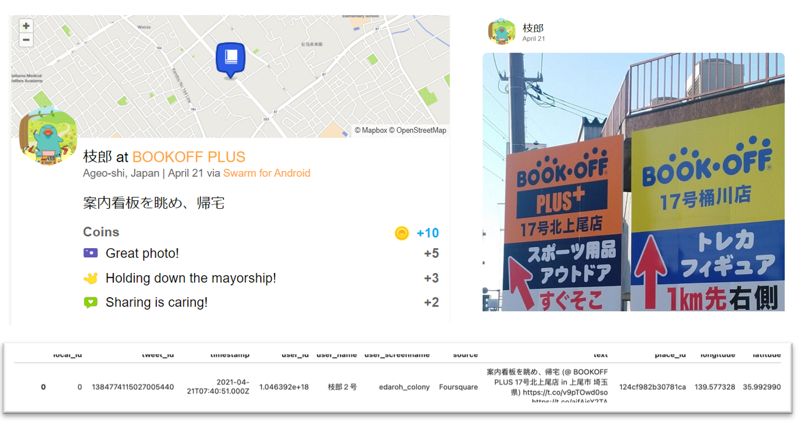
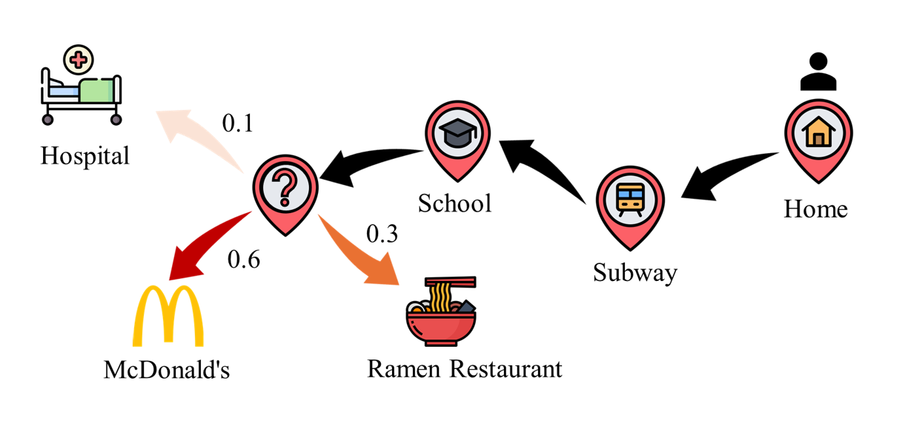
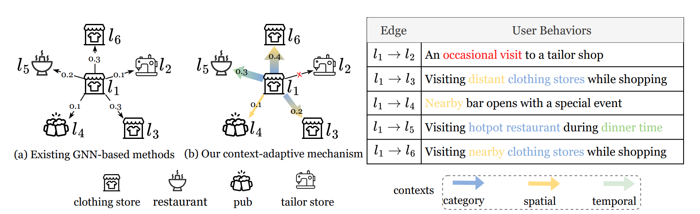

# Next POI Prediction

## What is POI?

A Point of Interest (POI) is a specific location that someone may find useful or interesting. For example, the University of Tokyo is a POI, and nearby locations such as Nezu Station and Todaimae Station can also be considered POIs.

## The Source of POI

Evolving Location Based Social Networks (LBSNs) platform, e.g., Foursquare, Gowalla, Tabelog(Japan's platform, but it doesn't open data).

<figure style="text-align: center;">
  
  <figcaption style="font-weight: bold; margin-top: 8px;">
    Figure 1: The example of POI source data
  </figcaption>
</figure>

As shown in Figure 1, one user checks in the Bookoff, so the platform can record his user ID, check-in POI ID, check-in time, latitude, longitude... Our task is based on the check-in data to finish the next POI prediction.

## What is the next POI prediction?

Now, we have a lot of users and users' check-in data. Specifically, we define these data as follows:

User set: $$U=\{u_1,u_2,\ldots,u_{\lvert U\rvert}\}.$$

POI set: $$P=\{p_1,p_2,\ldots,p_{\lvert P\rvert}\},\quad p=\langle lat,lon,(\text{cat}),\ldots\rangle.$$

**Cat** means POI's category, like restaurant, is optional.

User check-in set: $$q^{u}=\langle p,t\rangle.$$

**t** is the check-in time stamp.

User check-in trajectory set: $$S^{u}=\langle q^{u}_1,q^{u}_2,\ldots,;q^{u}_{\lvert S^{u}\rvert}\rangle.$$

As shown in Figure 2, based on User check-in trajectory set, we need to predict next POI the user will be most likely to visit.

<figure style="text-align: center;">
  
  <figcaption style="font-weight: bold; margin-top: 8px;">
    Figure 2: The example of next POI prediction.
  </figcaption>
</figure>

## Done: Graph-based next POI prediction

### What is Graph?

A graph is a set of nodes (vertices) and edges that describe relationships. In our datasets, nodes can be POIs, users, or time slots; edges encode interactions such as “user visited POI,” “two POIs are frequently visited consecutively,” or spatial proximity. Edges may carry weights (frequency, distance) and types (spatial, temporal, semantic).

<figure style="text-align: center;">
  
  <figcaption style="font-weight: bold; margin-top: 8px;">
    Figure 3: The example of a POI-POI transition graph. [1]
  </figcaption>
</figure>

### What is GNN?

GNN (Graph Neural Network) learns representations for nodes/edges/graphs by iteratively aggregating information from each node’s neighbors. At each layer, a node updates its embedding using its own features and messages from adjacent nodes, allowing the model to capture higher-order structure, heterogeneity, and long-range dependencies. We use GNN to mine graph knowledge to improve next POI prediction.

### Some past graph-based works

MobGT [2]: a multi-view approach that fuses global spatiotemporal graphs with per-user local graphs to capture fine-grained dependencies and boost accuracy.

LoTNext [3]: long-tail graph/logit adjustments with auxiliary tasks plus uncertainty-aware denoising via sample importance, delivering robust, balanced performance.

## Ongoing: LLM-based next POI prediction

LLM4POI: it reframes next-POI recommendation as a QA prompt, fine-tunes pretrained LLMs on textualized LBSN context (time, category, geo) to leverage commonsense, and reports SOTA on three real-world datasets.

Ongoing: LLM4POI enhancement, we are exploring privacy-preserving fine-tuning for next-POI LLMs, introducing differential privacy, and we routinely run membership-inference audits to quantify leakage on trajectory data.

## Reference

[1] Lei, Yu, et al. "Context-Adaptive Graph Neural Networks for Next POI Recommendation." arXiv preprint arXiv:2506.10329 (2025).

[2] Xu, Xiaohang, et al. "Revisiting mobility modeling with graph: A graph transformer model for next point-of-interest recommendation." Proceedings of the 31st ACM international conference on advances in geographic information systems. 2023.

[3] Xu, Xiaohang, et al. "Taming the long tail in human mobility prediction." Advances in Neural Information Processing Systems 37 (2024): 54748-54771.

[4] Li, Peibo, et al. "Large language models for next point-of-interest recommendation." Proceedings of the 47th International ACM SIGIR Conference on Research and Development in Information Retrieval. 2024.

If you are interested in my research or our lab, please contact xhxu[at]g.ecc.u-tokyo.ac.jp

