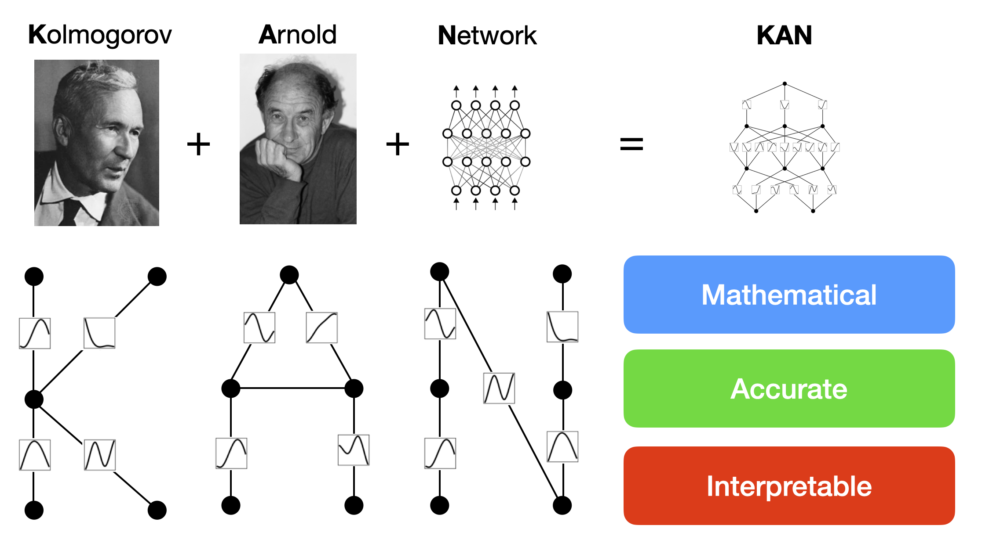
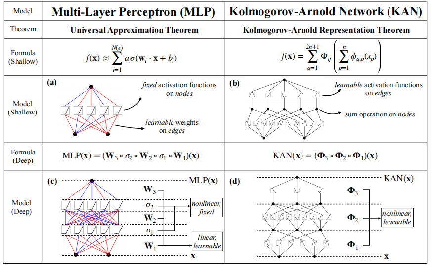
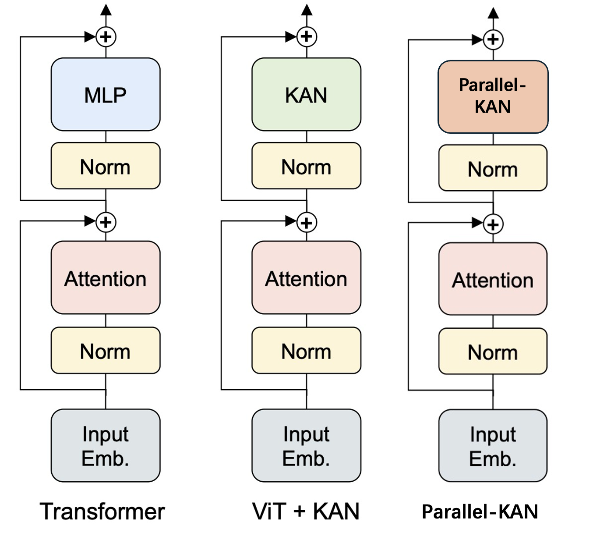

#  Kolmogorov–Arnold ネットワークの性能解析と高速化手法

## 研究の背景

KAN（Kolmogorov-Arnold Network）は、科学計算や機械学習といった分野において有用なツールとなり得る独自の特性を備えています。本研究では、物理シミュレーションや科学データ解析などの応用可能性を検討し、特にシンボリックな関数表現を扱う際におけるKANの利点に着目します。KANに関する包括的なレビューと分析を通じて、KANベースの応用研究の促進や、計算資源が限られた環境における活用の拡大を目指します。

近年、機械学習モデル、特にディープニューラルネットワークは、コンピュータビジョン、自然言語処理、ロボティクスなど、様々な分野において画期的な進展をもたらしてきました。しかし、モデルの巨大化と複雑化に伴い、特にスマートフォンやエッジコンピューティング環境など、計算資源やメモリが制限されるデバイス上での実装が困難になるという課題も顕在化しています。

## 現状の課題

このような制約に対処するため、モデル圧縮技術や高効率なニューラルアーキテクチャの開発に関心が高まっています。Kolmogorov-Arnold Networks（KAN）は、非常に少数のパラメータで複雑な関数を近似できる可能性を持つ点で注目されています。モデルサイズを大幅に削減しつつ性能を維持できるという特徴は、計算資源や保存領域が限られた環境において特に有利です。また、KANは Kolmogorov-Arnold 表現定理に基づいており、従来の深層モデルと比較して可解釈性が高い点も魅力と言えます。

## 研究の動機

本研究の動機は、従来の巨大な深層学習モデルが抱える課題に対し、KANを新たな代替手法として検討することにあります。パラメータ効率性と可解釈性に基づき、計算資源が限られた環境でも高性能なモデルを展開できる可能性を探ります。また、KANの理論的基盤の整理、実用上の利点の明確化、さらに学習効率における問題点の分析を通して、現実世界でKANを活用するための基礎を構築することを目指します。

